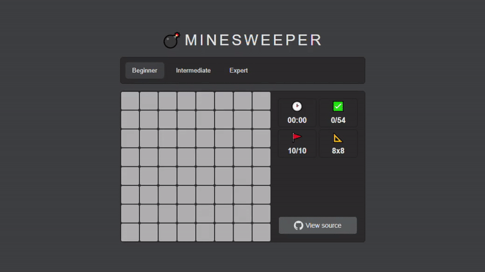

# Minesweeper React Typescript Game

Legendary game written in React with Hooks and Typescript

## Demo
See demo [here](https://minesweeper-react-typescript.vercel.app/)

## How to play
- Mines are scattered throughout a board, which is divided into fields.
- Fields have three states: uncovered, covered and flagged.
- A covered field is blank and clickable, while an uncovered field is exposed.
- Flagged fields indicate a potential mine location. The number of flags is equal to the number of bombs on the board.
- A left click uncovers a field. If you uncover a mined field, the game ends.
- Otherwise, the uncovered field displays either a number, indicating the number of mines diagonally and/or adjacent to it, or an empty field, and all adjacent non-mined fields will automatically be uncovered.
- Right-clicking on a field will flag it, causing a flag to appear on it. Flagged fields are still considered covered, and you can't click on them to uncover them. They must first be unflagged with an additional right-click.
- The first click in any game will never be a mine.
- To win the game, you must uncover all non-mine fields, at which point, the timer is stopped.
- Flagging all the mined fields is not required.

## What’s Inside?
- Project based on [create-react-app with TypeScript](https://create-react-app.dev/docs/adding-typescript/)
- `tsconfig.json` is in strict mode
- No implicit and explicit `any`, only static types, only hardcore :)
- Written entirely with hooks
- Loops optimizations and components memoization for preventing unnecessary renders
- Formatted with Prettier
- Precommit Husky hooks and lint-staged

## Available Scripts

In the project directory, you can run:

### `npm start`

Runs the app in the development mode.\
Open [http://localhost:3000](http://localhost:3000) to view it in the browser.

The page will reload if you make edits.\
You will also see any lint errors in the console.

### `npm test`

Launches the test runner in the interactive watch mode.\
See the section about [running tests](https://facebook.github.io/create-react-app/docs/running-tests) for more information.

### `npm run build`

Builds the app for production to the `build` folder.\
It correctly bundles React in production mode and optimizes the build for the best performance.

The build is minified and the filenames include the hashes.\
Your app is ready to be deployed!

See the section about [deployment](https://facebook.github.io/create-react-app/docs/deployment) for more information.

### `npm run eject`

**Note: this is a one-way operation. Once you `eject`, you can’t go back!**

If you aren’t satisfied with the build tool and configuration choices, you can `eject` at any time. This command will remove the single build dependency from your project.

Instead, it will copy all the configuration files and the transitive dependencies (webpack, Babel, ESLint, etc) right into your project so you have full control over them. All of the commands except `eject` will still work, but they will point to the copied scripts so you can tweak them. At this point you’re on your own.

You don’t have to ever use `eject`. The curated feature set is suitable for small and middle deployments, and you shouldn’t feel obligated to use this feature. However we understand that this tool wouldn’t be useful if you couldn’t customize it when you are ready for it.

## Maintainers
[Igor Sebelev](https://github.com/adlite)

## License
MIT
